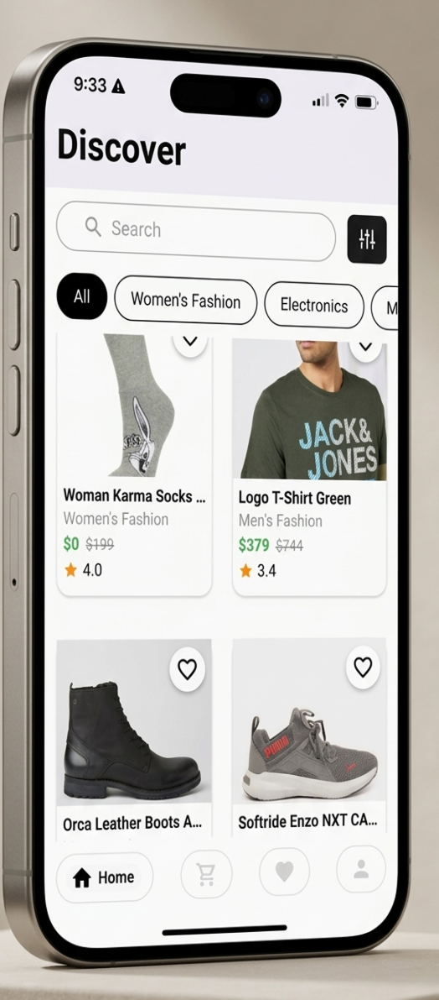
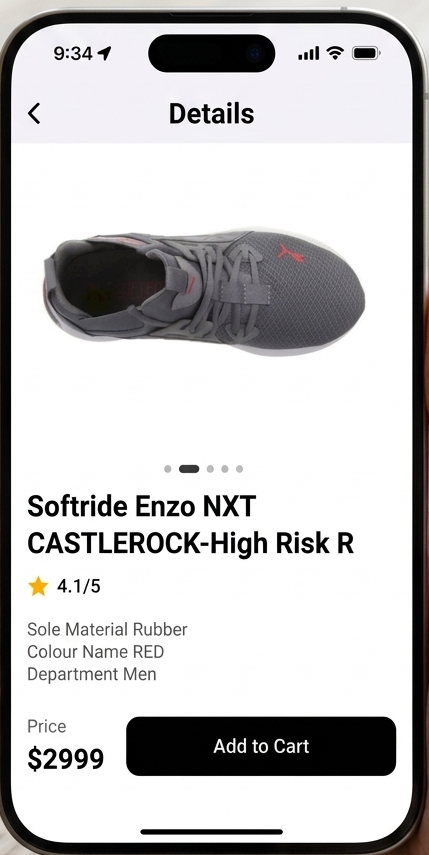
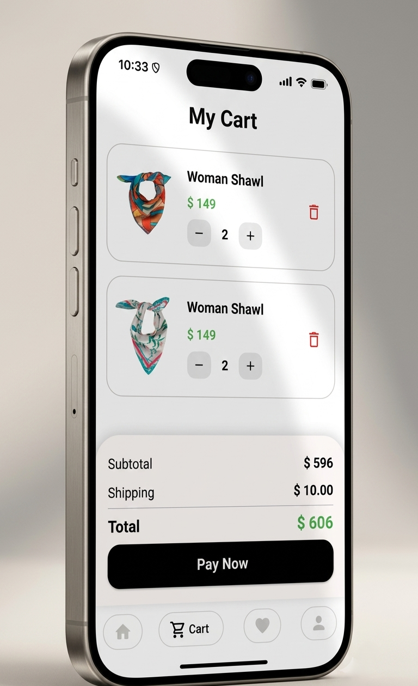
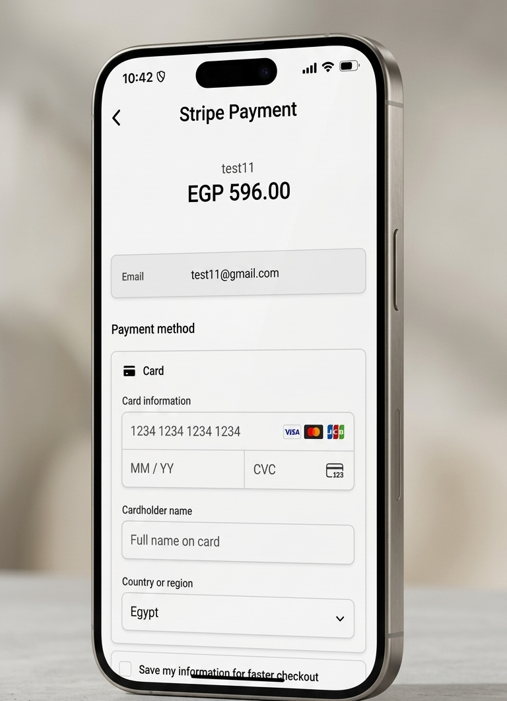
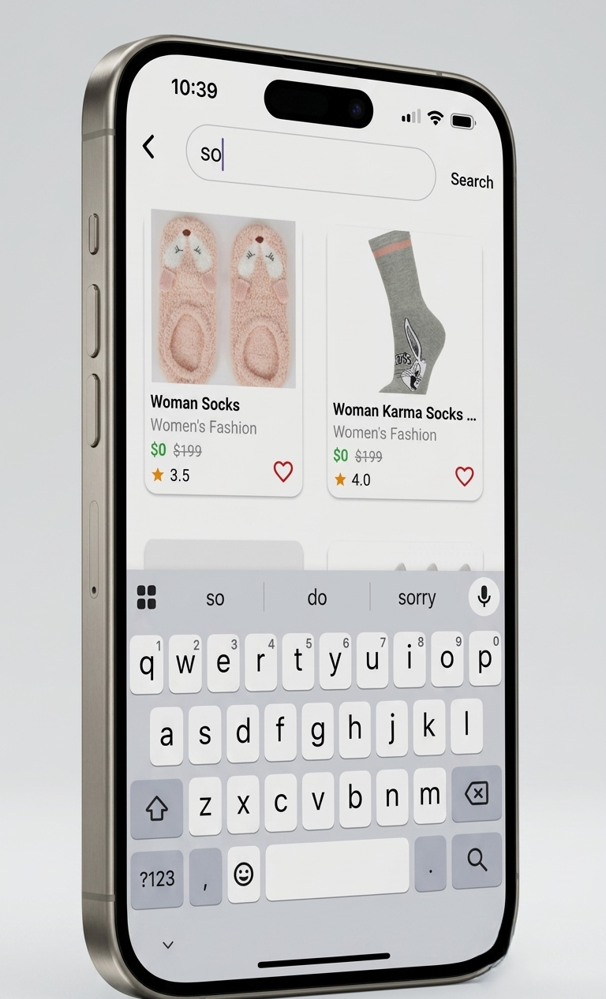
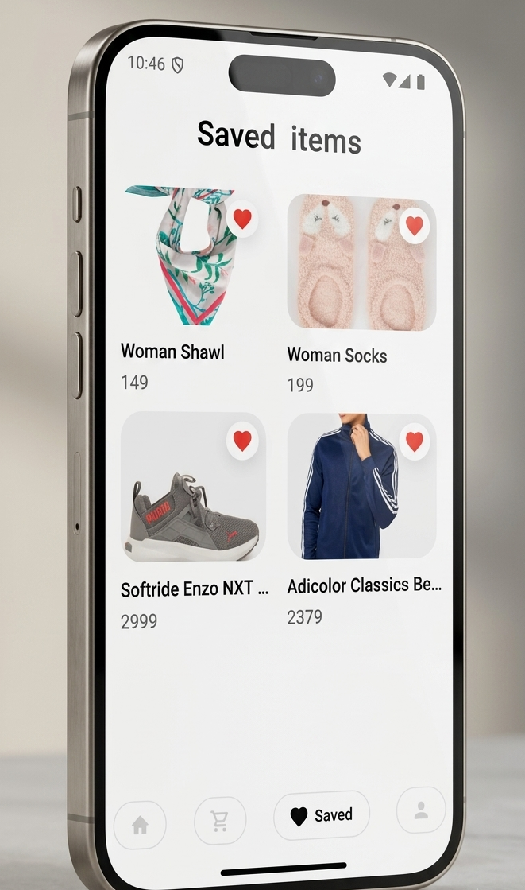

APP Review 
<p align="center">
  
  
  
  
  
  
</p>


# 🛍️ Elite Shop

A Flutter e-commerce application that provides a smooth shopping experience with product browsing, cart management, favorites, authentication, and checkout features.

## 📱 Overview

Elite Shop is a Flutter application designed to provide users with an easy and modern shopping experience.

Users can browse products, view product details, manage their cart, add products to favorites, and complete checkout operations.

---

## ✨ Features

### 🔐 Authentication
- ✅ User Login
- ✅ User Registration
- ✅ Forget Password
- ✅ Verify Reset Code
- ✅ Reset Password
- ✅ Token Storage & Verification

### 🏠 Home & Products
- ✅ Display products.
- ✅ View product details.
- ✅ Product images slider.
- ✅ Product rating display.
- ✅ Pagination for loading products.
- ✅ Product caching in Home using local database.

### 🛒 Cart
- ✅ Get cart data.
- ✅ Add products to cart.
- ✅ Update product quantity.
- ✅ Remove products from cart.
- ✅ Clear cart.

### ❤️ Favorites
- ✅ View favorite products.
- ✅ Add products to favorites.
- ✅ Remove products from favorites.

### 💳 Checkout
- ✅ Create checkout request.

### 👤 Profile
- ✅ Display profile information.
- ✅ Select profile image from camera.
- ✅ Select profile image from gallery.
- ✅ Logout.

---

## 🏗️ Architecture

The project follows **Clean Architecture** principles:

- 📂 Presentation Layer
- 📂 Domain Layer
- 📂 Data Layer

This separation helps create organized, maintainable, and scalable code.

---

## 🧩 State Management

- 🔹 Flutter Bloc

Used for managing application states and handling UI updates.

---

## 🔌 Dependency Injection

Implemented using:

- 📦 Injectable
- 📦 Get It

---

## 🌐 API Handling

Using Dio for network communication:

- 🔹 GET requests
- 🔹 POST requests
- 🔹 PUT requests
- 🔹 DELETE requests

Includes:

- ⏳ Request timeout handling.
- 🔑 Automatic token attachment.
- ⚠️ API error handling.

---

## 💾 Local Storage

### 🔐 Flutter Secure Storage
Used for storing authentication tokens securely.

### 🗄️ Sqflite Database
Used for caching products in the Home feature.

The cached product data includes:

- Product ID
- Title
- Description
- Price
- Images
- Category
- Rating
- Discount price

---

## 📦 Main Packages

- `flutter_bloc` → State management
- `dio` → API requests
- `sqflite` → Local database
- `flutter_secure_storage` → Secure token storage
- `injectable` → Dependency injection
- `get_it` → Service locator
- `cached_network_image` → Image caching
- `carousel_slider` → Product images slider
- `image_picker` → Camera & gallery images
- `lottie` → Animations

---

## 🚀 Getting Started

### Clone the repository

```bash
git clone <repository-url>
